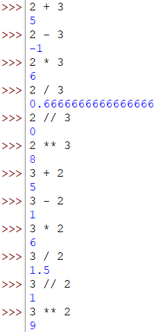

# Opdracht
Onderstaand vindt je diverse opdrachten waar je mee aan de slag kunt.

## Installatie Python
Download Python van https://python.org. Installeer het en kijk of je de Python applicatie kunt starten met de "python" app of met het "python" command op een command line prompt.

### Oefenen met de REPL
Het scherm dat zich opent is de REPL (Read Evaluate Print Loop). Je kunt hier direct Python commando's tikken en het resultaat direct zien. Dit is een niet te onderschatten krachtige mogelijkheid. Let wel, dit is niet hoe je in praktijk gaat programmeren. We raden je aan voor de opdrachten om een IDE als Pycharm of Visual Studio Code te installeren (zie ook de presentatie). 

# Standaard rekenoperatoren
Maak de volgende berekeningen en denk bij elke berekening na over het te verwachten resultaat. Voer de berekeningen uit in de REPL of in je IDE en kijk of het resultaat overeenkomt met je verwachting:

```python

2 + 3

2 - 3

2 * 3

2 / 3

2 // 3

2 ** 3

3 + 2

3 - 2

3 * 2

3 / 2

3 // 2

3 ** 2

```

### Output



## Haakjes
```python

23.95 * 32.9

23.95 * 32.9 + 6

(23.95 * 32.9) + 6

23.95 * (32.9 + 6)

23.95 / 32.9

23.95 / 32.9 + 6

(23.95 / 32.9) + 6

23.95 / (32.9 + 6)

```

### Output


## Variabelen
```python

name = "John Doe"
print(name)

street = 'Neverland Lane'
print(street)

items = 5
print(items)

price = 19.95
print(price)

students = 28
teachers = 3
seats = students + teachers
print(seats)

correct = students > teachers
print(correct)

incorrect = students > seats
print(incorrect)

line_character = '-'
line = line_character * 20
print(line)

```

### Output


# IDE's
IDE's zijn Integrated Development Environments. Hierin zitten meer functies dan alleen het teksteditor deel. Ze helpen je behoorlijk tijdens het ontwikkelen van je applicatie. Er zijn verschillende goede editors, zowel betaald als gratis open source of de community edities.
Enkele voorbeelden:
* PyCharm is er in betaalde en community editie versie. Studenten mogen een gratis licentie aanvragen voor de betaalde versie.
* Visual Studio Code aka VS Code is een gratis open source versie. Let op! Er is ook een "Visual Studio" versie, dit is een betaalde versie. We raden deze voor nu nog af. 
* Sublime Text is een text editor die zoveel mogelijkheden heeft dat hij ook vaak wordt gebruikt als IDE.

Installeer een van deze editors en probeer jezelf een beetje bekend te maken met de verschillende menu opties/mogelijkheden/etc. Kijk bijvoorbeeld een introductie youtube van jouw editor. Gebruik een IDE voor de verdere opdrachten.

# Combineren
Je kunt variabelen combineren met tekst. Dit heet een formatted string. Je kunt dit doen met de f-string notatie. Hierbij zet je een f voor de string en kun je variabelen tussen accolades zetten. Python vervangt de variabelen dan met de waarde van de variabele.

```python

city = 'Rotterdam'
print(city)
type(city)

residents = 623652
print(residents)
type(residents)

area = 324.1
print(area)
type(area)

# Formatted string, variabele in string weergeven
print(f'The city of {city} has {residents} on an area of {area} square kilometers')

```

### Output

